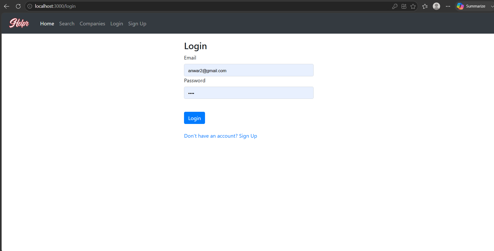
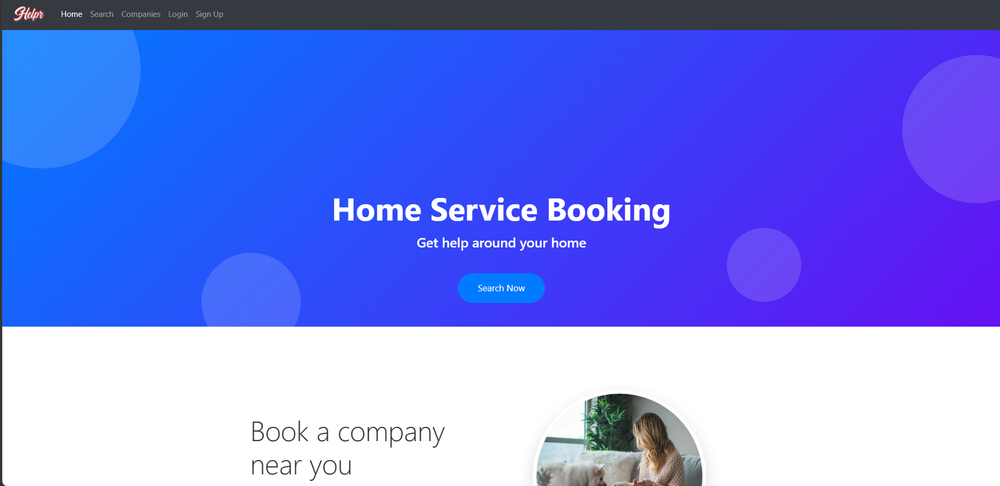
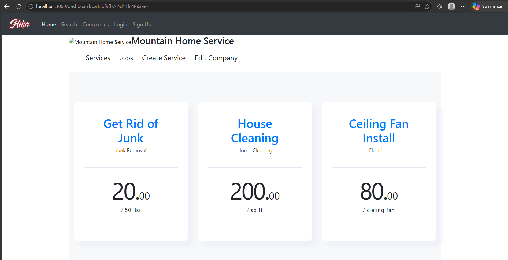
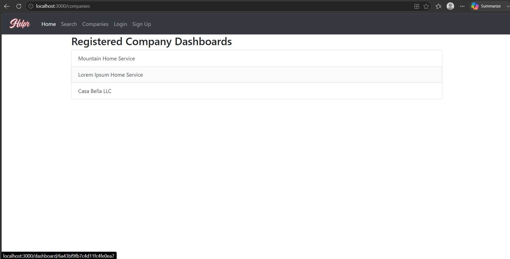

# 🚀 Service Booking Marketplace Ecosystem

An enterprise-grade, full-stack service booking platform engineered to connect clients with service providers seamlessly. This application utilizes a decoupled, microservices-style architecture, combining a robust **Spring Boot REST API** with a highly responsive, state-managed **React.js** frontend ecosystem. 

Designed with scalability, optimized query handling, and strict separation of concerns in mind, it represents a production-ready approach to service marketplace infrastructure.

---

## 📸 Application Interface Preview

<table width="100%">
  <tr>
    <td width="50%" align="center">
      <b>🔐 Gateway Authentication</b>
      <br />
      
    </td>
    <td width="50%" align="center">
      <b>📊 Core Control Dashboard</b>
      <br />
      
    </td>
  </tr>
  <tr>
    <td width="50%" align="center">
      <b>🛠️ Services Catalog</b>
      <br />
      
    </td>
    <td width="50%" align="center">
      <b>🏢 Provider Directories</b>
      <br />
      
    </td>
  </tr>
  <tr>
    <td colspan="2" align="center">
      <b>📦 Live Allocation & Job Tracking</b>
      <br />
      
    </td>
  </tr>
</table>

---

## 🏗 System Architecture & Tech Stack

The system is split into distinct logical boundaries, ensuring high cohesion, modularity, and easy horizontal scaling.

| Layer | Technology | Engineering Focus |
| :--- | :--- | :--- |
| **Backend Core** | Java 17+ | Type-safe execution, multi-threading capability |
| **Framework Engine**| Spring Boot 3.x | Decoupled business logic, automatic dependency injection, and centralized routing |
| **Data Persistence**| MongoDB | Schema-agnostic document storage, optimized indexing for active job tracking |
| **Client Interface**| React.js | Reusable component architectures, virtual DOM reconciliation |
| **State Middleware**| Redux Toolkit | Predictable, unidirectional global state synchronization |
| **UI Matrix** | Bootstrap / Custom CSS | Mobile-first viewport flexibility, strict responsive layouts |
| **Automation** | Maven & npm | Isolated containerized dependency builds |

---

## 🔥 Key Architectural Highlights

* **Layered Separation (Controller ➔ Service ➔ Repository):** Guarantees zero leakages between the database layer and communication interfaces.
* **Asynchronous-Ready Dispatching:** Designed to handle real-time modifications across concurrent users booking the same resources.
* **Document-Model Synergy:** Leverages MongoDB's sub-document structural capabilities to store flexible job matrices without heavy relational joins.

---

## 🔗 REST API Reference

The backend exposes a highly predictable, standardized REST API layer structured around semantic HTTP verbs.

### 🏢 Provider Ecosystem (Companies)
* `GET    /api/company` — Retrieve all active providers
* `GET    /api/company/{id}` — Fetch specific provider profile
* `POST   /api/company` — Provision a new business entry
* `PATCH  /api/company/{id}` — Modify company state configurations
* `DELETE /api/company/{id}` — Deprecate a corporate provider entry

### 🛠️ Service Management
* `GET    /api/service` — Stream available market items
* `GET    /api/service/{id}` — Inspect specific service payloads
* `GET    /api/service?cat={id}&cid={id}` — Multi-tier category/provider filter query
* `POST   /api/service` — Author a new service entity
* `PATCH  /api/service/{id}` — Mutate service criteria details
* `DELETE /api/service/{id}` — Clear a service offering from active listings

### 📦 Job Allocation Lifecycle
* `GET    /api/job` — Track complete cluster bookings
* `GET    /api/job?cid={id}` — Segment jobs by designated company node
* `POST   /api/job` — Instantiate a real-time reservation request
* `PATCH  /api/job/{id}` — Adjust parameters of an existing dispatch
* `PATCH  /api/confirm/{id}` — Administrative confirmation lock
* `DELETE /api/job/{id}` — Safely de-allocate a cancelled reservation

---
## 📂 Structural Topography

```text
service-booking-app/
│
├── service/                  # Distributed Spring Boot Framework
│   ├── src/main/java/...
│   │   ├── controller/       # Network Request Handlers & DTO Mapping
│   │   ├── service/          # Core Domain Processing & Transaction Rules
│   │   ├── repository/       # Data Pipeline Access abstractions (MongoRepository)
│   │   ├── model/            # Document Models & Object Definitions
│   │   └── config/           # Cross-Origin (CORS) & System Profiles
│   └── pom.xml               # Target Maven Build Descriptor
│
├── client/                   # Single Page Application (SPA) Client
│   ├── src/
│   │   ├── components/       # Stateless Atomic UI Elements
│   │   ├── pages/            # Stateful Core Layout Templates
│   │   └── redux/            # Store Orchestration & Action Dispatchers
│   └── package.json          # Node Module Configuration Manifest
│
└── README.md

```
---

## ⚙️ Engineering Environment Setup

### Prerequisites
Before initializing the platform, ensure your local environment is provisioned with the following core dependencies:
* **Java Development Kit (JDK):** Version 17 or higher (LTS)
* **Node.js:** v18+ alongside the `npm` package manager
* **Database Engine:** MongoDB Server (Active local instance or cloud-hosted Atlas cluster)

### 📍 Step 1: Repository Acquisition & Workspace Entry
Clone the repository architecture and navigate to the project root directory:
```bash
git clone [https://github.com/ahmedbaiginam-stack/service-booking-app.git](https://github.com/ahmedbaiginam-stack/service-booking-app.git)
cd service-booking-app
```
## 📍 Step 2: Backend Service Ignition (Spring Boot)
Compile the source code, resolve Maven dependencies, and boot the RESTful API engine:
cd service
mvn clean install
mvn spring-boot:run

🟢 System Status: The backend API gateway will initialize and bind securely to 
```bash
http://localhost:8080.
```
## 📍 Step 3: Client Interface Mount (React)
Install the required Node modules and launch the single-page application:
Bash
cd ../client
npm install
npm start
🟢 System Status: The Webpack development server will spin up the interactive user dashboard at 
```bash
http://localhost:3000.
```
---
## 🔮 Future Architecture Roadmap
To scale this ecosystem toward a production-ready, cloud-native state, the following technical epics are currently scheduled:

🔐 Zero-Trust Security (JWT): Implementing state-free, token-based authorization mechanics coupled with granular Role-Based Access Control (RBAC).

💳 Payment Processing Gateways: Integrating a robust commercial checkout pipeline to facilitate secure, end-to-end service transactions.

📧 Event-Driven Messaging: Setting up a non-blocking message broker queue (or SMTP layer) to dispatch automated transactional notifications and live tracking alerts.

🐳 Containerized Orchestration: Authoring optimized, multi-stage Docker configurations for streamlined deployment across distributed cloud networks.


---

## 👨‍💻 Lead Developer
Ahmedbaig Inamdar

Creative Full-Stack Software Engineer | Bengaluru, Karnataka, India

Specializing in architecting cloud-native web applications, building high-throughput REST APIs, and designing enterprise-grade ecosystems using Java, Spring Boot, SQL/NoSQL database management systems, and React.


